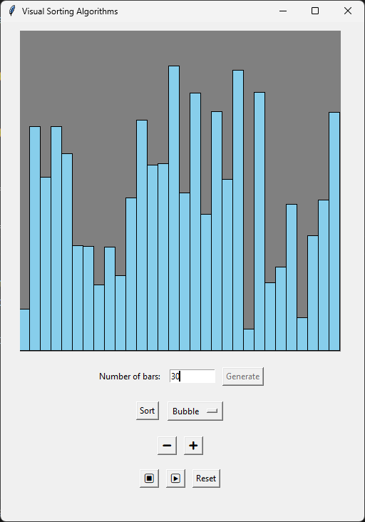
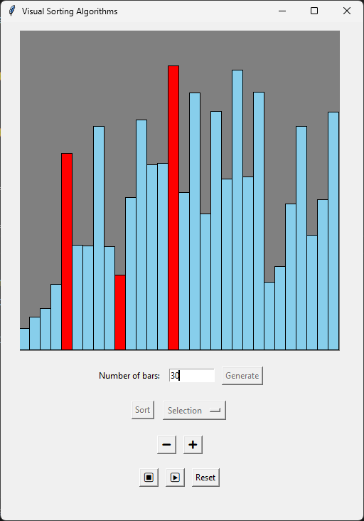

# Visual Sorting Algorithms

A Python application that visualizes sorting algorithms using Tkinter GUI. This interactive tool helps users understand how different sorting algorithms work by displaying the step-by-step process visually.

## Features

* **Algorithm Visualization**: Watch the sorting process in real-time with colored bars
* **Multiple Algorithms**: Currently supports Bubble Sort, Insertion Sort, and Selection Sort
* **Playback Controls**: Start, stop, continue, and reset sorting operations
* **Speed Adjustment**: Control the visualization speed (faster/slower)
* **Random Data Generation**: Create new random datasets to sort
* **Customizable Data Size**: Choose how many elements to sort

## How to Use

1. Enter the number of elements you want to sort
2. Click the **Generate** button to create a random array of values (represented as bars)
3. Select a sorting algorithm from the dropdown menu (Bubble, Insertion, or Selection)
4. Click the **Sort** button to start the visualization
5. Use the playback controls:

   * ⏹️ (Stop): Pause the sorting process
   * ▶️ (Continue): Resume a paused sorting process
   * **Reset**: Clear the canvas and reset all values
6. Adjust the sorting speed using the ➖ (slower) and ➕ (faster) buttons

## Screenshots




## Visual Feedback

* **Blue bars**: Unsorted/normal elements
* **Red bars**: Elements currently being compared or moved
* **Green bars**: Completely sorted array (when sorting is finished)

## Implementation Details

* Written in Python using Tkinter for the GUI
* Implements step-by-step visualization of sorting algorithms
* Uses canvas for rendering the bars
* Each algorithm is implemented as a recursive function with step-by-step execution
* Algorithms track their state to support pausing and resuming
* Uses after() method for animation timing

## Requirements

* Python 3.x
* Tkinter (included in standard Python installation)

## Running the Application

```
python3 main.py
```

This project provides an educational tool for understanding sorting algorithms through visual representation, making it easier to grasp the concepts of different sorting techniques.